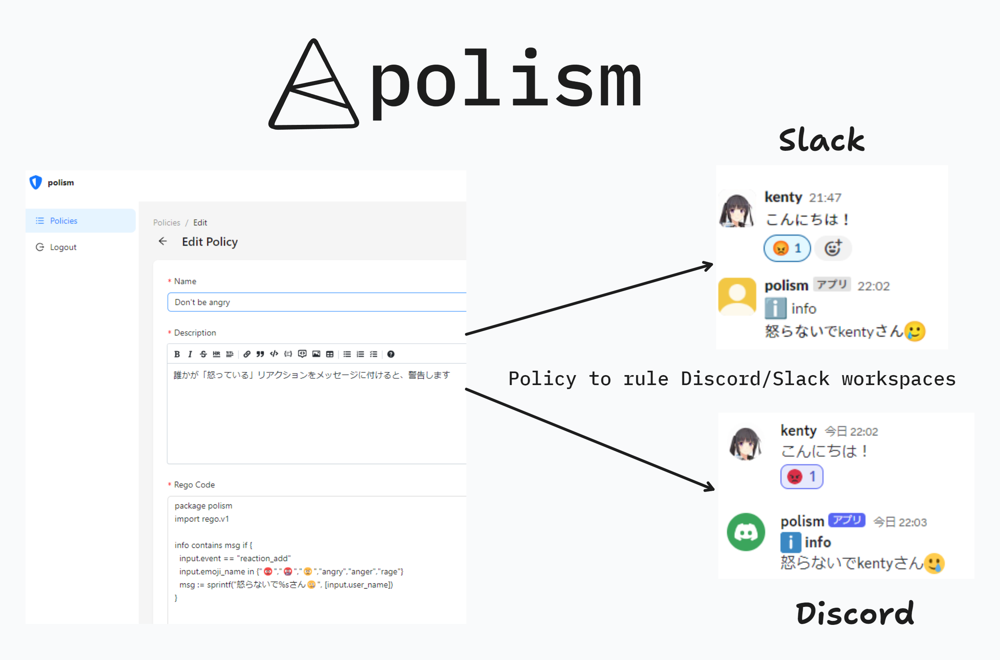

# polism

## 概要

**TL;DR Regoという言語を使ってDiscordやSlackのBotがローコードで書けます**

DiscordやSlackのサーバー（ワークスペース）を、Regoポリシーで管理するためのツールです。

一つのポリシーをDiscord,Slackの両方に適用することができます。

例えば以下のようなポリシーを書き、適用することができます。
- サーバー上で好ましくない行動を取った人に警告する
- サーバー上で怪しい行動を取った人をモデレーターに知らせる
- サーバー上で特定の行動を取った人をBANする

現在はプロトタイプです。使い方は全く整備されていません。後日デプロイ予定

開発環境での起動方法
1. 各フォルダの.envのサンプルをコピーし、各種項目を入力
2. それぞれを起動

## システム構成
- Supabase
  - 認証＆データベースです。
- enforcer
  - DiscordやSlackのAPIと通信し、ポリシーを適用します。
  - TypeScript, Node.js
- evaluator
  - OPAのライブラリを使用し、ポリシーを評価します。
  - Go, OPA
- web-ui
  - ポリシーを管理するためのWeb UIです。
  - Refine, Ant Design, Vite
